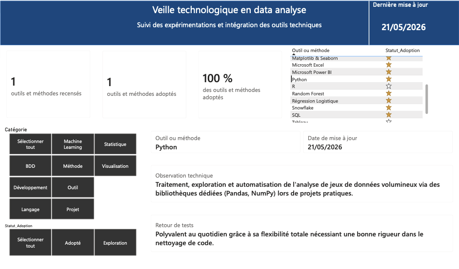

[Accueil](https://couac403.github.io/data-analyst-portfolio/) | [Mon CV interactif](./01_pbi_cv/) | [Mon LinkedIn](https://www.linkedin.com/in/mounier-florian) | [Me contacter par mail](mailto:florian.mounier@ikmail.com)

---

# Veille technologique

## Présentation
Synthèse d'études et de suivis des outils et méthodes liés à la data analyse.

>

## Contenu du dossier
* [`veille_pbi.pbix`](./veille_pbi.pbix) : Rapport Power BI.
* [`veille_pbi.pdf`](./veille_pbi.pdf) : Version statique imprimable.
* [`data_veille.xlsx`](./data/data_veille.xlsx) : Données sources du rapport Power BI.

## Compétences
* **Techniques :** Power BI, DAX
