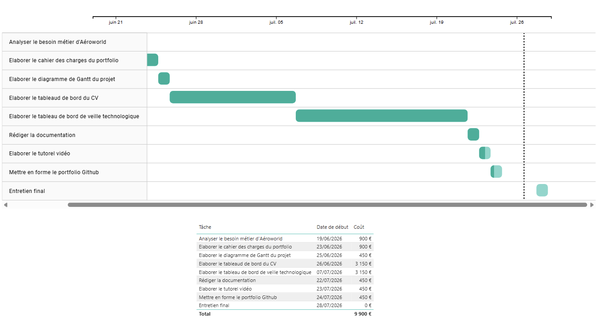

[Accueil](https://couac403.github.io/data-analyst-portfolio/) | [CV interactif](https://couac403.github.io/data-analyst-portfolio/01_pbi_cv/) | [LinkedIn](https://www.linkedin.com/in/mounier-florian) | [Me contacter par mail](mailto:florian.mounier@ikmail.com)

---

# Pilotage de projet

## Présentation
Cadrage du projet de création du portfolio, planification temporelle (Gantt) et chiffrage des coûts.

### **Dashboard projet (Gantt et tableau des coûts) :** 
>
>
>
>
### **Indicateur PageSpeed Insights du portfolio pour la navigation sur ordinateur :**
>
> 
## Contenu du dossier
* [`besoins_aeroworld.pdf`](./besoins_aeroworld.pdf) : Expression et analyse des besoins métiers de l'employeur.
* [`cdc_portfolio.pdf`](./cdc_portfolio.pdf) : Cahier des charges de l'élaboration du portfolio de candidature adapté aux besoins.
* [`gantt.pbix`](./gantt.pbix) : Diagramme de Gantt du projet de création du protfolio.
* [`gantt.pdf`](./gantt.pdf) : Version statique imprimable du diagramme de Gantt.
* [`data_gantt.xlsx`](./data/data_gantt.xlsx) : Données sources du Gantt.
* [`gantt.png`](./assets/gantt.png) : Illustration du rapport.
* [`pagespeed_mobile.pdf`](./pagespeed_mobile.pdf) : Indicateur PageSpeed Insights pour la navigation sur mobile.
* [`pagespeed_ordinateur.pdf`](./pagespeed_ordinateur.pdf) : Indicateur PageSpeed Insights pour la navigation sur ordinateur.
* [`pagespeed.png`](./assets/pagespeed.png) : Illustration de l'indicateur PageSpeed Insights pour la navigation sur ordinateur.

## Compétences
* **Techniques :** Power BI
* **Relationnelles :** Storytelling, Sensibilité Métiers, Gestion de Projet
