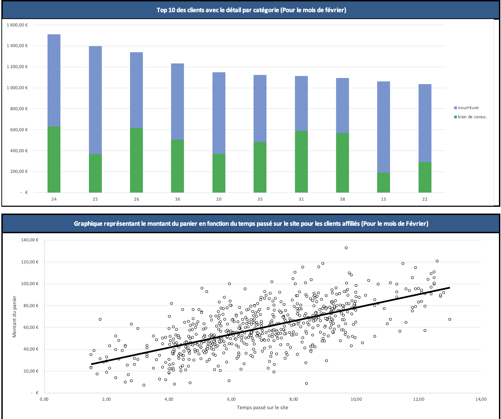
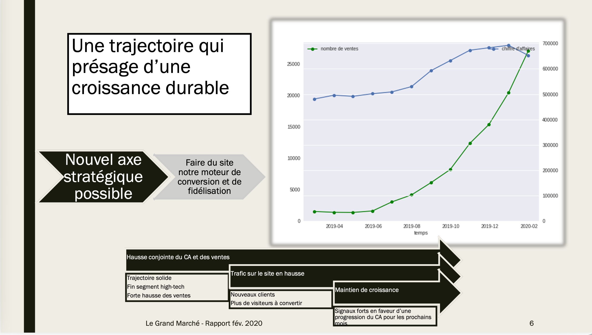

[Accueil](https://couac403.github.io/data-analyst-portfolio/) | [CV interactif](https://couac403.github.io/data-analyst-portfolio/01_pbi_cv/) | [LinkedIn](https://www.linkedin.com/in/mounier-florian) | [Me contacter par mail](mailto:florian.mounier@ikmail.com)

---

# Analyse de ventes e-commerce

## Présentation
Reporting mensuel de performance des ventes et analyse des données client.

**Visuels du reporting :**
>

>
**Extrait du rapport mensuel :**
>

## Contenu du dossier et téléchargements
* [`clients_affilies.xlsx`](./clients_affilies.xlsx) : Fichier de calcul et d'analyse des ventes mensuelles des clients affiliés.
* [`rapport_mensuel.pdf`](./rapport_mensuel.pdf) : Rapport mensuel de Février 2020.
* [`clients_affilies.png`](./assets/clients_affilies.png) : Illustration du fichier de calcul et d'analyse.
* [`rapport_mensuel.png`](./assets/rapport_mensuel.png) : Illustration du rapport mensuel.

## Compétences
* **Techniques :** Excel
* **Relationnelles :** Storytelling, Sens Business
