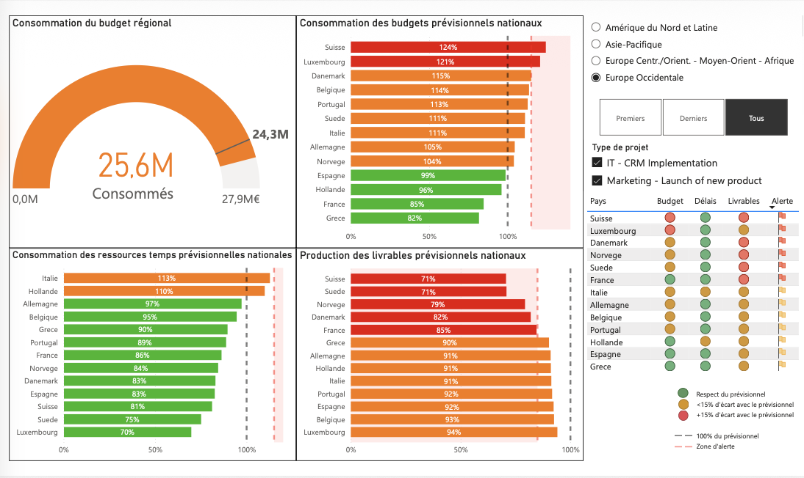

[Accueil](https://couac403.github.io/data-analyst-portfolio/) | [CV interactif](https://couac403.github.io/data-analyst-portfolio/01_pbi_cv/) | [LinkedIn](https://www.linkedin.com/in/mounier-florian) | [Me contacter par mail](mailto:florian.mounier@ikmail.com)

---

# Tableau de bord dynamique de suivi de projets

## Présentation
Tableau de bord opérationnel avec alertes personnalisées selon le rôle utilisateur.

Se servir de ces tableaux de bord comme un déclencheur d'actions immédiates en optimisant la chaîne décisionnelle et en réduisant la latence entre la détection d'un problème et la mesure corrective.

> **Illustration de la vue du Directeur Régional Europe Occidentale :**
> 
> 

## Contenu du dossier et téléchargements
* [`tableau_de_bord.pbix`](./tableau_de_bord.pbix) : Rapport Power BI.
* [`tableau_de_bord.pdf`](./tableau_de_bord.pdf) : Version statique imprimable.
* [`presentation.pdf`](./presentation.pdf) : Support de présentation.
* [`psc.pdf`](./psc.pdf) : Product Strategy Canvas du projet.
* [`tableau_de_bord.png`](./assets/tableau_de_bord.png) : Illustration du rapport.

## Compétences
* **Techniques :** Power BI 
* **Relationnelles :** Storytelling, Sensibilité Métiers
