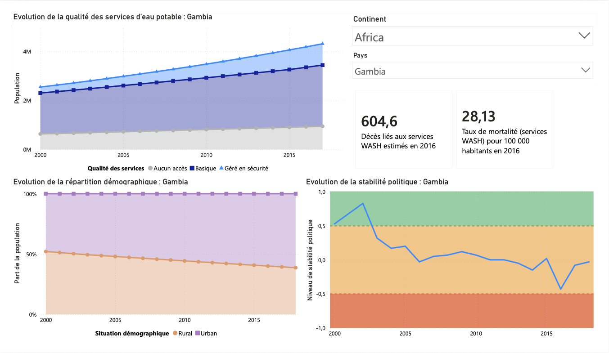

[Accueil](https://couac403.github.io/data-analyst-portfolio/) | [CV interactif](https://couac403.github.io/data-analyst-portfolio/01_pbi_cv/) | [LinkedIn](https://www.linkedin.com/in/mounier-florian) | [Me contacter par mail](mailto:florian.mounier@ikmail.com)

---

# Accès mondial à l'eau potable

## Présentation
Tableau de bord à fort impact stratégique pour évaluer l'accès aux ressources sanitaires.

Transformer les données mondiales en leviers stratégiques, permettant à la DWFA de cibler avec précision ses investissements pour un impact maximal sur l'accès universel à l'eau potable.

### **Illustration de la vue nationale pour la Gambie :**
> 

## Contenu du dossier et téléchargements
* [`dashboard.pbix`](./dashboard.pbix) : Rapport Power BI.
* [`dashboard.pdf`](./dashboard.pdf) : Version statique imprimable.
* [`presentation.pdf`](./presentation.pdf) : Support de présentation.
* [`dashboard.png`](./assets/dashboard.png) : Illustration du rapport.

## Compétences
* **Techniques :** Power BI 
* **Relationnelles :** Storytelling, Sensibilité Métiers, Sens Business
