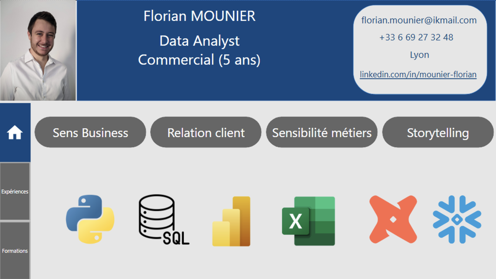

# Portfolio Data & Analytics de Florian Mounier

Bienvenue sur mon portfolio, il rassemble les projets en **Business Intelligence**, **Data Engineering** et **Data Science** que j'ai réalisés jusqu'à présent et sera alimenté au fil de ceux à venir.

---

## Mon CV interactif Power BI

Afin de combiner présentation professionnelle et maîtrise technique de Power BI, j'ai conçu mon CV sous forme de tableau de bord interactif mettant en lien mes compétences techniques et relationnelles avec mes expériences professionnelles, formations et projets présentés dans ce portfolio.

> **Démonstration dynamique du dashboard :**
> [Voir](./01_pbi_cv/assets/demo_cv_pbi.mov)
> 
> 
>
> **[Télécharger le PBIX](./01_pbi_cv/cv_pbi.pbix)**
>
> **[Télécharger le PDF](./01_pbi_cv/cv_pbi.pdf)**

---

## Sommaire des Projets

| Projet | Technologies et outils | Description | Accès |
| :--- | :--- | :--- | :---: |
| **CV interactif** | Power BI | Tableau de bord dynamique retraçant mon parcours, mes compétences et mes réalisations. | [Voir](./01_pbi_cv/) |
| **Veille technologique** | Power BI, DAX | Synthèse d'études et de suivis des outils et méthodes liés à la data analyse. | [Voir](./02_pbi_veille_tech/) |
| **Pilotage de projet** | Power BI, Gestion de projet | Cadrage du projet de création du portfolio, planification temporelle (Gantt) et chiffrage des coûts. | [Voir](./03_gestion_projet_portfolio/) |
| **Tutoriel de création d'un rapport Power BI** | Power BI, Vulgarisation | Conception d'une capsule vidéo pédagogique pour créer un visuel Gantt sur Power BI. | [Voir](./04_video_tutoriel_pbi/) |
| **Analyse de ventes e-commerce** | Excel, Sens Business | Reporting mensuel de performance des ventes et analyse des données client. | [Voir](./05_excel_analyse_ecommerce/) |
| **Base de données et requêtage SQL** | SQL, Modélisation | Conception d'une base relationnelle, reqêtages complexes et rédaction d'une méthodologie. | [Voir](./06_sql_requetage/) |
| **Étude de Santé Publique** | Python, Storytelling | Analyse de la disponibilité alimentaire mondiale sur la période 2013-2017. | [Voir](./07_python_sante_publique/) |
| **Modélisation d'une base de données immobilière** | SQL, RGPD, Modélisation | BDD relationnelle conforme RGPD pour l'analyse prospective des prix de l'immobilier. | [Voir](./08_sql_immobilier/) |
| **Optimisation d'une base de données d'une boutique** | Python, Sens Business | Etude du catalogue, analyse des ventes et réorganisation de la base de donnée d'une boutique. | [Voir](./09_python_optimisation_bdd/) |
| **Tableau de bord dynamique de suivi de projets** | Power BI, Sensibilité Métiers | Tableau de bord opérationnel avec alertes personnalisées selon le rôle utilisateur. | [Voir](./10_pbi_suivi_projets/) |
| **Profils sociodémographiques** | DBT Cloud, Snowflakes | Mise en corrélation des caractéristiques sociodémographiques et segmentation des étudiants d'une école. | [Voir](./11_dbt_snowflake_etudiants/) |
| **Analyse des ventes d'une librairie** | Python, statistiques, Sens Business | Analyse statistique bivariée, test d'hypothèses et segmentation de la clientèle. | [Voir](./12_python_analyse_librairie/) |
| **Accès mondial à l'eau potable** | Power BI, Storytelling | Tableau de bord à fort impact stratégique pour évaluer l'accès aux ressources sanitaires. | [Voir](./13_pbi_eau_potable/) |
| **Étude de Marché Agroalimentaire** | Python, Storytelling, Sens Business, Sensibilité Métiers | Classification ascendante hiérarchique et ACP pour cibler les pays à fort potentiel avec l'objectif de se développer à l'international. | [Voir](./14_python_etude_marche/) |
| **Détection de Faux Billets** | Python, Machine Learning | Test et création d'un pipeline de machine learning pour la détection de faux billets. | [Voir](./15_python_ml_billets/) |

---

## Contacts

* **LinkedIn :** [linkedin.com/in/mounier-florian](https://www.linkedin.com/in/mounier-florian)
* **Email :** [florian.mounier@ikmail.com](mailto:florian.mounier@ikmail.com)
